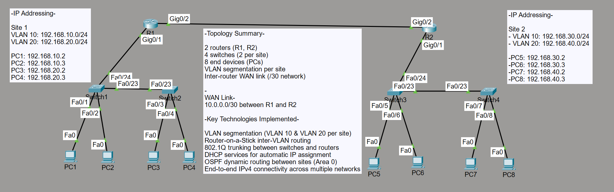

# multi-site-network-lab

-Multi-Site Enterprise Network Lab (VLAN + OSPF + DHCP)-

This project simulates a multi-site enterprise network designed and configured in Cisco Packet Tracer. It demonstrates VLAN segmentation, inter-VLAN routing, DHCP services, and dynamic routing using OSPF between two separate LAN environments.

The goal of this lab was to replicate a scalable enterprise network architecture and validate end-to-end connectivity across multiple routed networks.

-Topology Description-

The network consists of:

2 Routers (R1, R2)
4 Switches (2 per site)
8 End Devices (PCs)
VLAN-based segmentation per site
WAN link between routers using a /30 subnet

Topology Diagram:
()

-IP Addressing Scheme-
Site 1
VLAN 10 (IT): 192.168.10.0/24
VLAN 20 (HR): 192.168.20.0/24
Site 2
VLAN 10 (IT): 192.168.30.0/24
VLAN 20 (HR): 192.168.40.0/24
WAN Link
R1 ↔ R2: 10.0.0.0/30

-Key Technologies Implemented-
VLAN creation and segmentation
802.1Q trunking between switches and routers
Router-on-a-Stick inter-VLAN routing
DHCP services for automatic IP assignment
OSPF dynamic routing (Area 0)
Inter-site connectivity across multiple networks

-Configuration Summary-
VLAN Configuration
VLAN 10: IT Department
VLAN 20: HR Department
Assigned access ports per department
Trunking
Enabled 802.1Q trunk links between switches and routers
Allowed VLANs 10 and 20
Routing
Router-on-a-stick configured on both routers
OSPF enabled for dynamic route exchange between sites
Verified OSPF neighbor adjacency (FULL state)
DHCP
DHCP pools configured per VLAN
Automatic IP assignment for all end devices

-Verification & Testing-

The following tests were completed successfully:

DHCP IP assignment for all clients
Intra-VLAN communication (same VLAN devices)
Inter-VLAN routing within each site
End-to-end connectivity between Site 1 and Site 2
OSPF neighbor adjacency established
Dynamic routing table updates verified

-Evidence of Configuration-
VLANs

(Insert VLAN verification screenshot: show vlan brief)

Trunk Links

(Insert show interfaces trunk screenshot)

Routing Table

(Insert show ip route screenshot)

OSPF Neighbor Status

(Insert show ip ospf neighbor screenshot)

DHCP Leases

(Insert show ip dhcp binding screenshot)

Connectivity Tests

(Insert ping test screenshots across sites)
